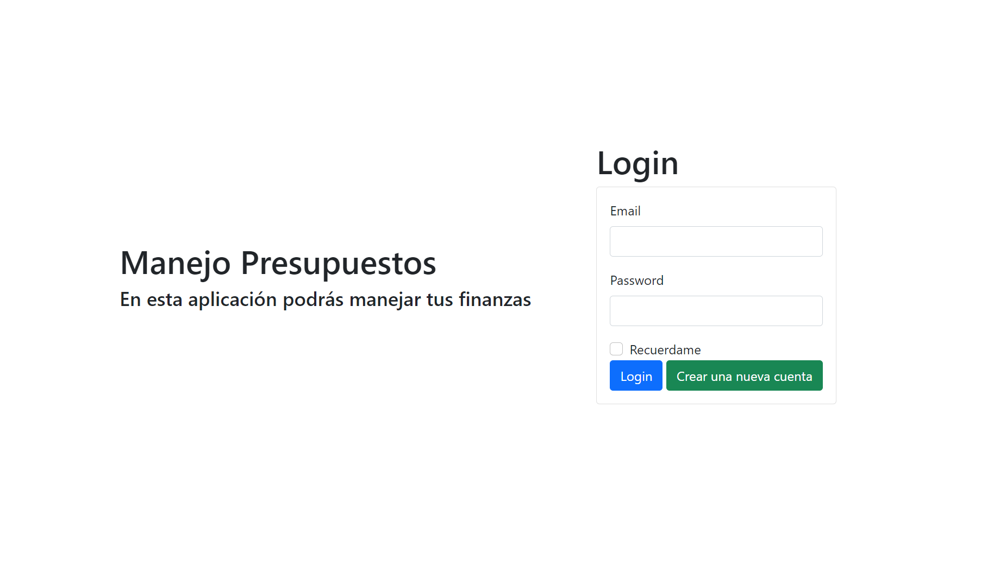
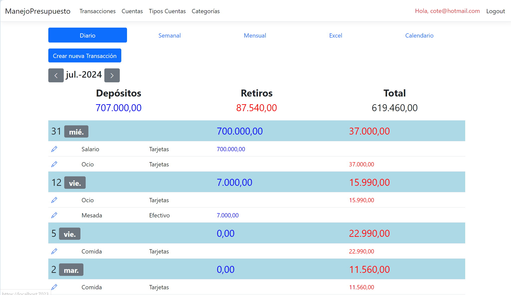
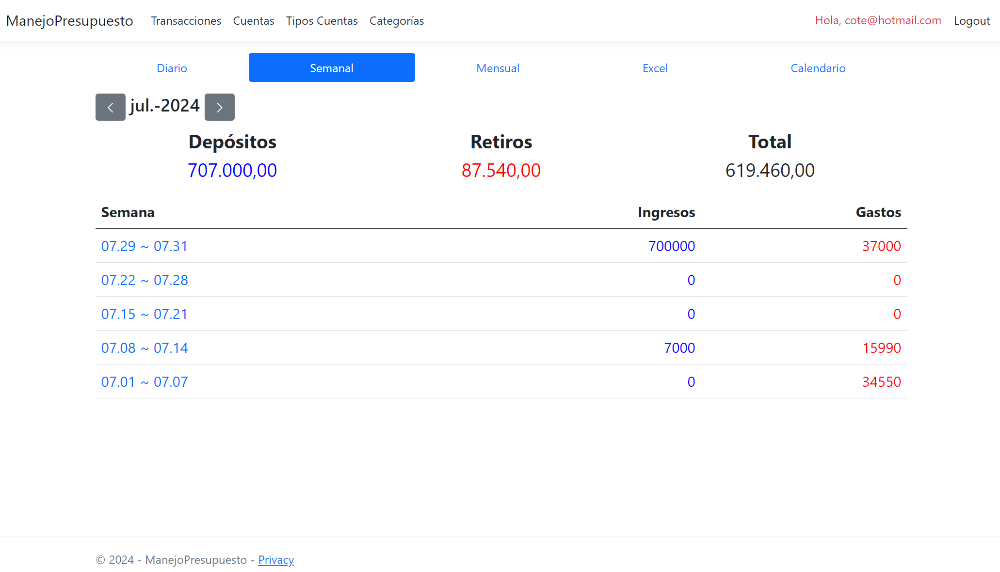
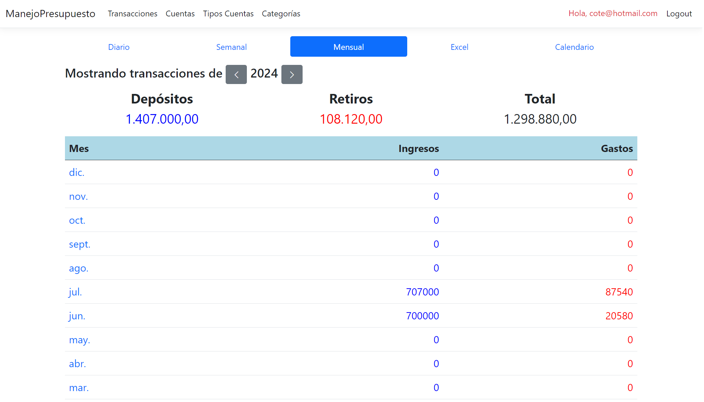
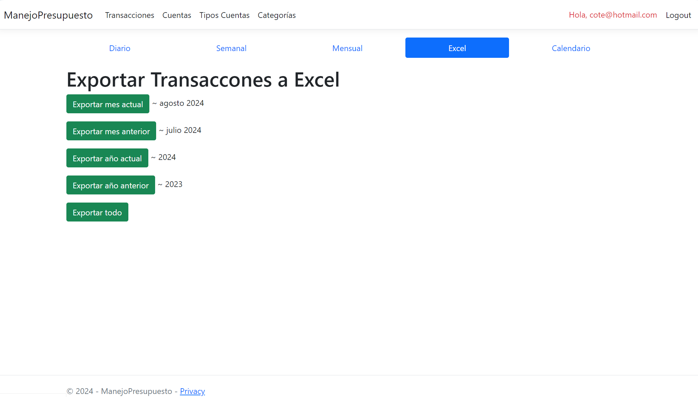
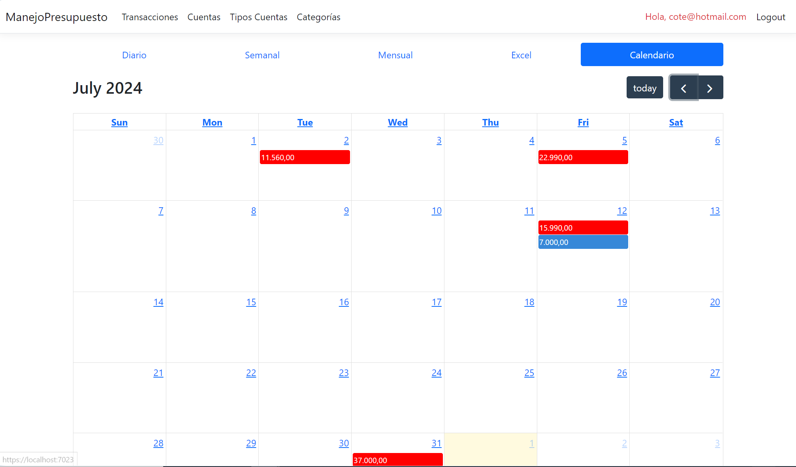
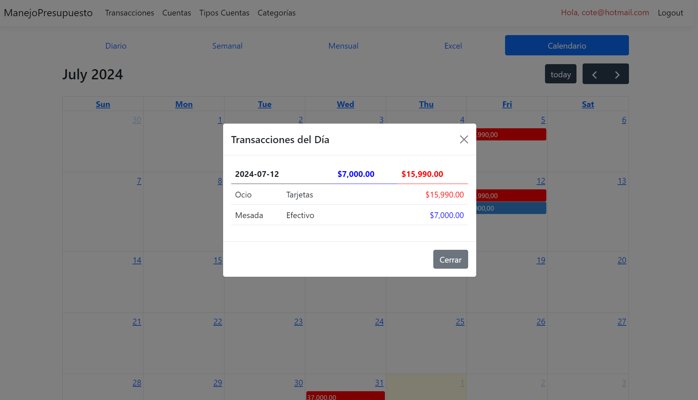
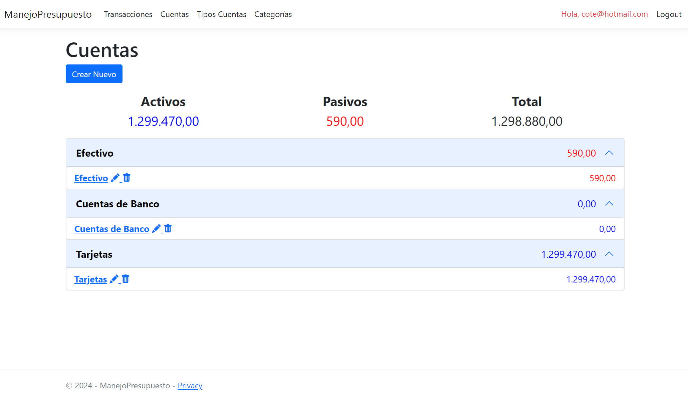
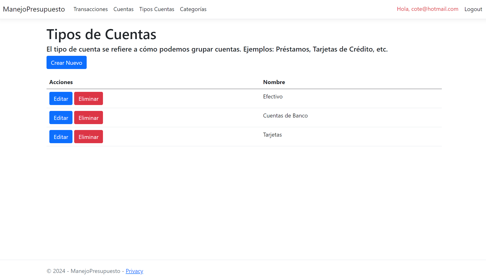
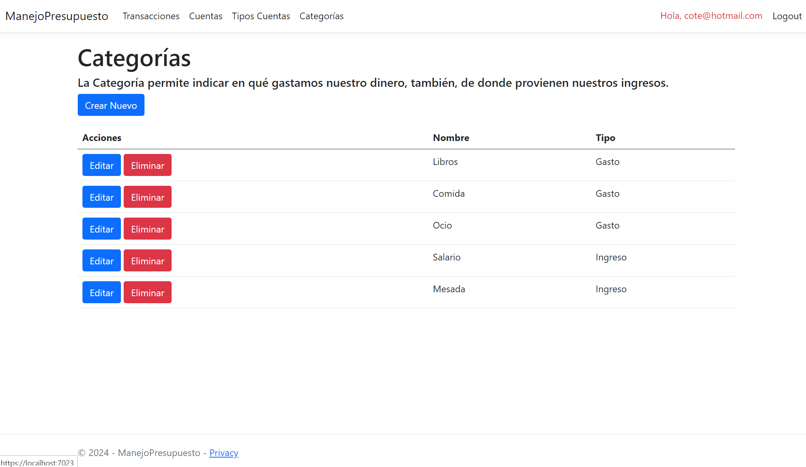

# Proyecto de Manejo de Presupuesto

## Login y Registro
Al iniciar la aplicación, se mostrará por defecto la siguiente interfaz para el inicio de sesión y registro.

## Interfaz de Transacciones
Esta es la interfaz de bienvenida que aparece después de iniciar sesión. En la parte superior derecha de la pantalla, dentro de la barra de navegación, se encuentra el correo electrónico del usuario y el botón "Logout". La barra de navegación también incluye enlaces a transacciones, cuentas, tipos de cuentas y categorías.

Debajo de la barra de navegación, se encuentra un submenú con botones que permiten visualizar las transacciones de manera diaria, semanal, mensual, exportar a Excel o verlas en formato de calendario. A continuación, está el botón "Crear Nueva Transacción".

Finalmente, se muestra un resumen financiero del mes de julio, que incluye depósitos, retiros y el total. A continuación, se presenta una lista de transacciones organizadas por fecha, con detalles como descripción, método de pago, monto y un icono de lápiz para editar cada transacción.

## Interfaz de Transacciones "Semanal"
Interfaz con el resumen financiero semanal para un mes específico, en este caso, julio.

## Interfaz de Transacciones "Mensual"
Interfaz con el resumen financiero mensual para un año específico, en este caso, 2024.

## Interfaz de Transacciones "Excel"
Interfaz con el resumen financiero del mes y año actual y anterior, para exportar en formato Excel.

## Interfaz de Transacciones "Calendario"
Interfaz con el resumen financiero del mes seleccionado, en este caso, julio. Los gastos se destacan en rojo y los ingresos en azul. Además, se incluye una función de clic en el calendario para mostrar las transacciones del día seleccionado y ofrecer una vista más detallada.

## Modal con las transacciones del día
Este modal, como se mencionó anteriormente, muestra en detalle las transacciones del día seleccionado.

## Intrefaz de Cuentas
En esta interfaz se presenta un CRUD (Crear, Leer, Actualizar, Eliminar) para gestionar los tipos de cuentas previamente creados. Se destacan dos conceptos clave que permiten comprender la situación financiera del usuario y calcular el patrimonio neto: el "Total".

## Intrefaz de Tipos Cuentas
Esta interfaz muestra un CRUD para el tipo de cuenta.

## Intrefaz de Categorías
Esta interfaz presenta un CRUD para gestionar las categorías de gastos, permitiendo registrar en qué se gasta el dinero.

